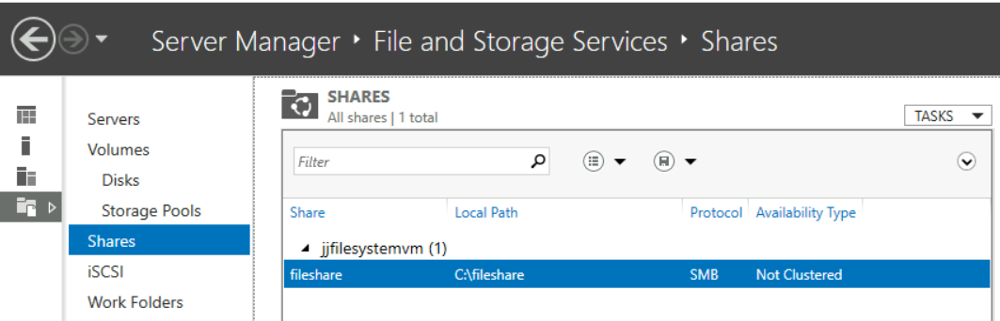
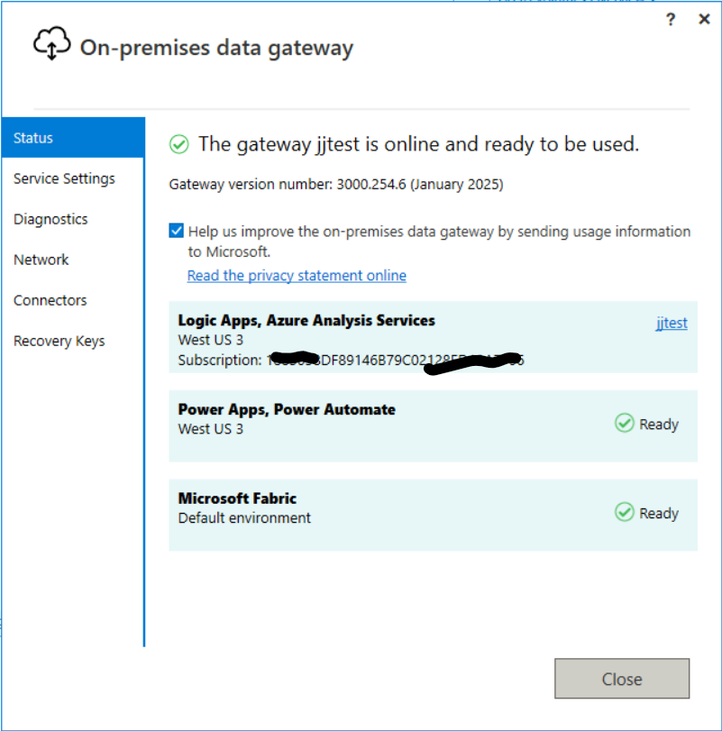
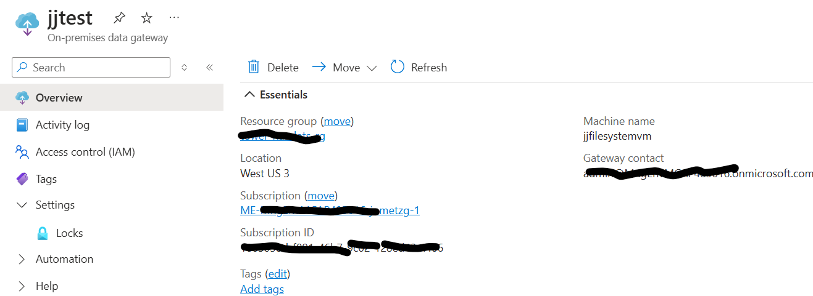
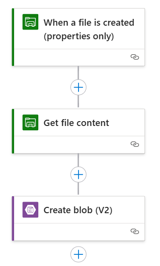
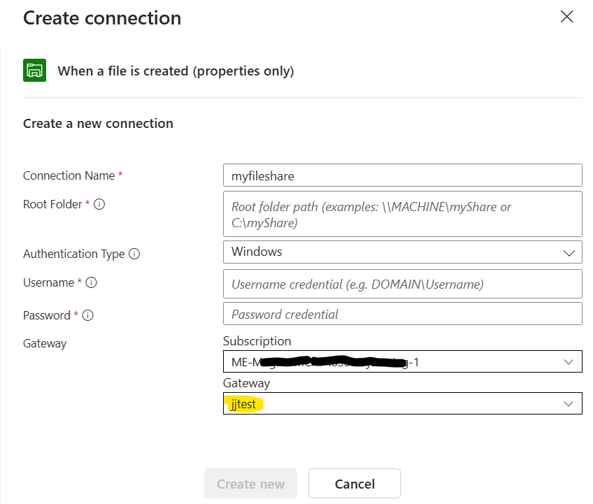
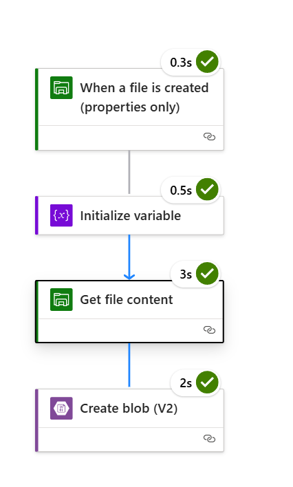
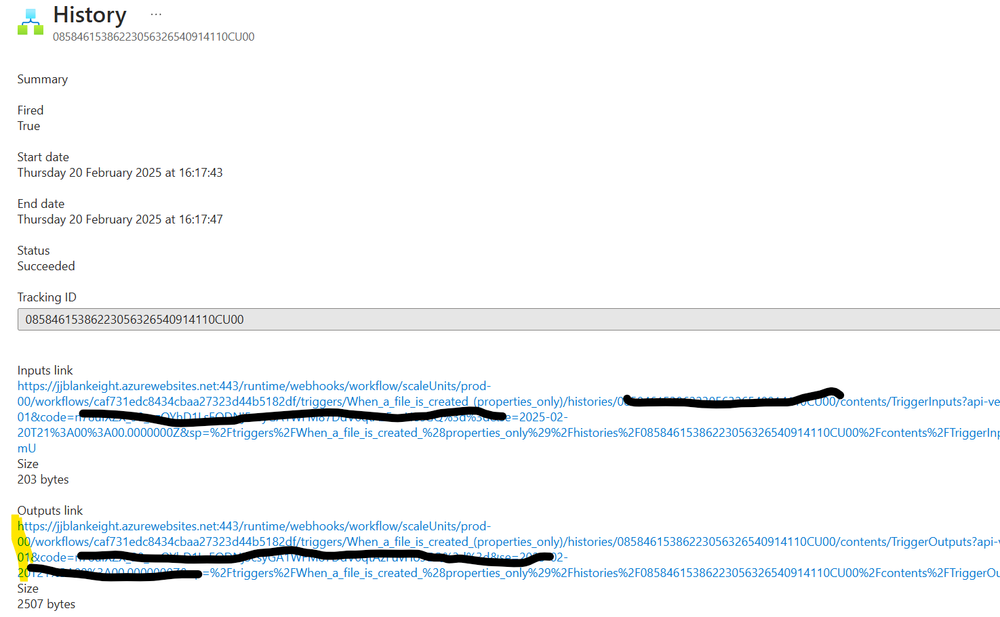

# File-Share Triggered Logic App Standard

This repo shows how a Logic App Standard can work with Windows file shares as a trigger.

## Logic Apps and File Shares
Azure Logic Apps has 2 different versions, the original Logic Apps Consumption (tier) and the newer Logic Apps Standard (tier) - which builds on the Azure App Services runtime. The differences are discussed [here](https://learn.microsoft.com/en-us/azure/logic-apps/single-tenant-overview-compare).

This repo will discuss Logic Apps Standard.

Besides the tier, there are different workflow [runtimes](https://learn.microsoft.com/en-us/azure/logic-apps/create-single-tenant-workflows-azure-portal#create-a-standard-logic-app-resource):
1. Workflow Service Plan
2. App Service Environment V3
3. Hybrid

The default is the *Workflow Service Plan*.

## File Shares
These are file shares hosted on a Windows Server environment. These are common in enterprises that use Windows Server. File and Storage Services on Windows Server allow the creation of *Shares* that may be used to trigger Logic App workflows.

In the above, there is a file share that is called *fileshare* and is mapped to the folder on the server as *C:\\fileshare*

## Connecting to file shares
There are serveral ways in which a logic app may gain access to a file share:
1. if the file share is public, then no special measures are needed
2. if private and the Logic App is on the Workflow Service Plan, then a, [on-premise data gateway](https://learn.microsoft.com/en-us/data-integration/gateway/service-gateway-onprem) is needed. As of the time of writing in February 2025
3. if private and the Logic App is on an App Service Environment V3 (ASE), then the (ASE) naturally is on a virtual network and you may be able to route to the Windows Server that hosts the file server directly.

 > The above will be validated with the Logic App product group, but this is the understanding at this time.

## Installing the On-Premise Data Gateway
There are essentially 2 components to this gateway:
1. the agent that is installed on a virtual machine to manage this access. The default is to install this on the same VM as the Windows Server that hosts the file share.
2. An Azure component to which the gateway communicates.

## The VM installation
This requires an agent install to be downloaded to the Windows Server and installed with some Azure credentials that have access to the target Azure subscription.
Once installed it looks like this:

The Azure service looks like below:

When both of these are installed, then the file share may be accessed via the data gateway.

## A simple Logic App workflow triggerd by the file share
Below is a simple workflow that triggers on a file being added to the Windows Server file share. It then copies it to blob storage.

The most important part of this workflow is how the connection is setup to the file trigger. Some sample settings are below:

As can be seen from above, there needs to be:
1. a name for the connection
2. the UNC form of the fileshare *\\MACHINE_NAME\sharename*
3. credentials for a user on the file server
4. the on-premise gateway to be used.

Once all of these have been configured, the workflow is now capable of being triggered from adding a file to the file share.

## Sample workflow run
Below is a sample of a successful run of the workflow triggered by a file being added to the share:

## Troublshooting
### Trigger not firing
This is the most complex one and needs all of the moving parts to be in place. Need to check:
1. by getting a session onto the Windows Server VM, check that you are using the correct file share in server manager
2. also open up the on premise data gateway app on the Windows Server to check it is connecting
3. In Azure check whether the on-premise data gateway looks good
4. In the logic app workflow, check the *trigger history*. If there is an error click through the links to see the nature of the error. The one to click through is the *Outputs link* - this will give more detail on why the trigger did not run.

Click through the highlighted link.

### Trigger firing, but an error in workflow run
This is a much more easy error to debuf and this is much like any other logic app:
1. click on the run
2. look at the step that fails
3. look at the properties of the step
4. for the simple workflow, it will generally be not picking up the filename correctly from the trigger or not getting the content of the file name

### Workflow sample code
This repo contains the JSON workflow definition of the above flow. This is under the *workflow* folder
